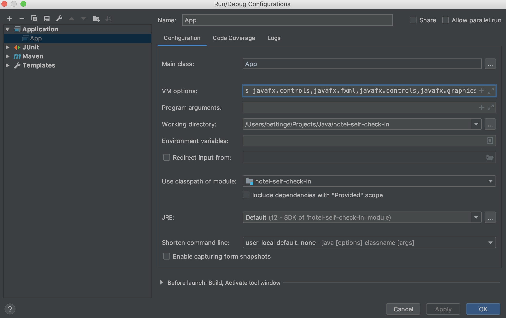

# 226B - hotel self check-in
Schulprojekt mod 226B

Dies ist der Git des Schulprojektes hotel self check-in von Sarah Bettinger und Tobias Schläpfer im modul 226B

## Projekt Setup

### Benötigte Libraries:

* Java JDK 12
* JavaFX SDK 12.0.1 
  * [Download Site](https://gluonhq.com/products/javafx/)
  * Es muss nicht installiert werden, sondern lediglich entpackt. Es empfiehlt sich den entpackten Ordner aus dem Downloadverzeichnis zu verschieben. Beispielsweise an einen Ort an dem auch das JDK (fuer Mac: `/Library/Java/JavaVirtualMachines`) liegt
* Maven 3.x

### Starten aus der Kommandozeile:

1. `mvn clean install `
2. `mvn javafx:run`

Nun sollte die Applkation starten.

### Starten aus der IDE:

1. Importiere das Maven-Projekt

2. In IntelliJ Idea muss dies als VM Parameter zur Run Konfiguration hinzugefügt werden:

   `--module-path /Library/Java/JavaVirtualMachines/javafx-sdk-12.0.1/lib --add-modules javafx.controls,javafx.fxml,javafx.controls,javafx.graphics`
   
   wobei `--module-path ` der Pfad zur Installation des JavaFX SDK ist und `--add-modules` die benötigten JAR's sind.

